## 问题的引出

你是否是一个Minecraft爱好者，但并不知道如何和自己的好友联机？也许你尝试过一些方法，例如使用网易版我的世界，但实际上它的局限性非常大，于是，便有了这篇文章

## 准备工作

你需要：

- 一台配置足够，且有网络连接的电脑，（如果想用同一个电脑同时运行服务端和客户端，推荐内存**16GB+**，系统推荐**Windows 10**或**Windows 11**）
- 脑子

以下教程都运行在一台AMD Ryzen 7 5800H和双通道16×2G DDR4 3200Mhz，系统为Windows 10企业版的环境下

## Java的选择与下载

**Minecraft**游戏本体需要安装**Java**，服务端也不例外，根据不同的版本，我们也应该选择不同的**Java**

- **1.16-**（不包含） 推荐使用[**Java8**](https://www.java.com/en/download/)（点击绿色的**Download Java**）
- **1.16** 推荐使用[**Java16**](https://www.oracle.com/java/technologies/javase/jdk16-archive-downloads.html)（需注册**Oracle**账号，在下方选择**Windows x64 Installer**）
- **1.17+**（包含）推荐使用[**Java17**](https://download.oracle.com/java/17/latest/jdk-17_windows-x64_bin.exe)

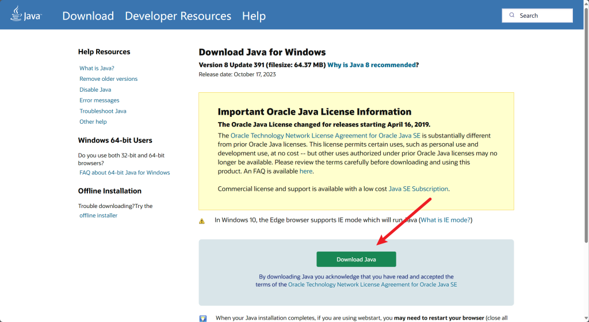

## 服务端核心的下载

众所周知，玩游戏必须要有游戏文件，而开一个服务器也是同理，需要服务端文件，而这就是**服务端核心**，服务端核心也是用不同种类的，可以大体分为几种：

- 原版核心（**Vanilla**）
- 插件核心（如**Paper**）
- mod核心（如**Forge**）

其实核心并不止这些种类，还有**BungeeCord**、**PocketMine**等并不属于上述三类，但在此不做过多说明

在此仅介绍以**Paper**为核心的服务端，因为**Paper**是目前来说，最热门的服务端，也是新手最容易上手的服务端，其他的服务端如何开服，请大家自行寻找方法

首先，进入[**Paper官方网站下载页面**](https://papermc.io/downloads/all)，这里以1.16.5为例，在左侧找到1.16.5，并点击最上方的**Download**按钮，进行下载

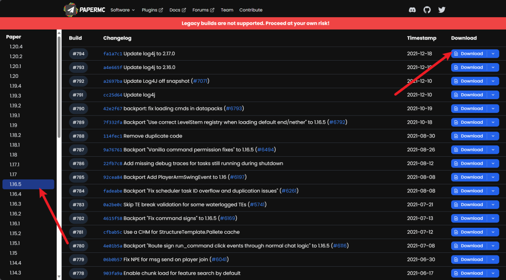

下载后的**paper-1.16.5-794.jar**，记住该文件的位置，以后要用

## 服务端面板的下载与使用

理论上来说，服务端只需要命令行就可以启动，然而没有图形化界面的服务端显然是不利于新手的，于是很多的服务端面板便出现了，现在有很多服务端面板可用，在此使用[MCSManager](https://mcsmanager.com/)，进入网站后，点击**立刻下载**，并找到**Windows**下的**下载安装包**，下载后解压，此时可以打开文件夹中的**MCSManager-启动器.exe**，如果没有问题，将会出现这样一个窗口：

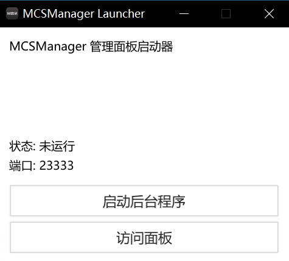

点击**启动后台程序**，几秒钟后应该会弹出你的默认浏览器（若未弹出，点击**访问面板**），点击**开始使用**后，**注册账号**后，点击**老用户**（因为我们使用自己下载的客户端）

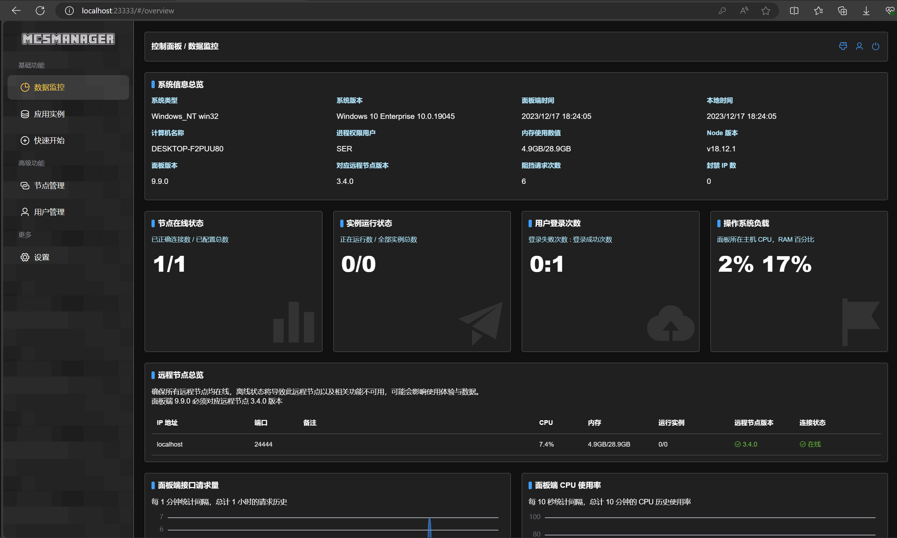

点击左侧**快速开始**——**创建一个 Minecraft 服务器**——**普通流程创建服务器**——**Java 版 Minecraft 游戏服务端**——**上传单个服务器软件**

**实例名称**随意，**启动命令模板**和**服务端文件目录**可以不用管，然后点击**上传服务端软件**，选择我们刚刚下载的**paper-1.16.5-794.jar**

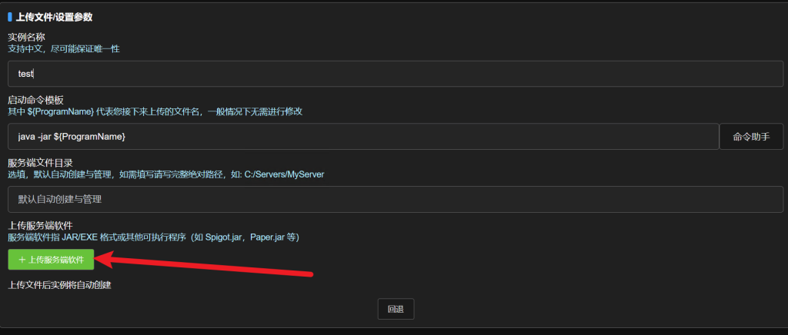

然后我们点击**前往编辑实例具体参数**，先留在这个界面，接下来的流程要在此页面编辑

## 进行Frp内网穿透

Frp，全称fast reverse proxy，我们不需要深究其中的原理，联机需要使用frp服务的原因是由于ipv4数量有限，而ipv6并未普及，所以几乎所有的家庭宽带是没有公网ip的，所以我们必须要用Frp进行内网穿透

同样，市面上的Frp也有很多，为了方便新手使用，我们这里选择**MCSManager**所支持的[**OpenFrp**](https://www.openfrp.net/)，进行完常规的注册后，先点击右上角的链接进行**实名认证**

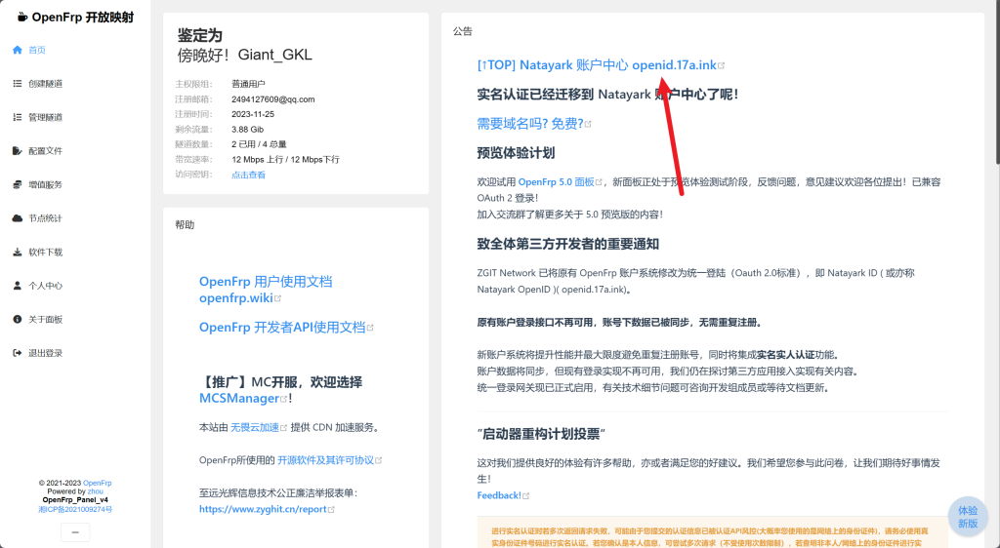

实名认证完成后，点击左侧**创建隧道**，选择上方**隐藏不可用**和**隐藏会员节点**，在右侧**隧道名称**随意填写，**隧道类型**选择**TCP隧道**，**本地地址**填写**127.0.0.1**，**本地端口**填写**25565**，**远程端口**点下方**随机远程端口**，其他默认即可，然后点击右下角**提交**（如果显示**远程端口不可用或已被占用**，多试一试**随机远程端口**）

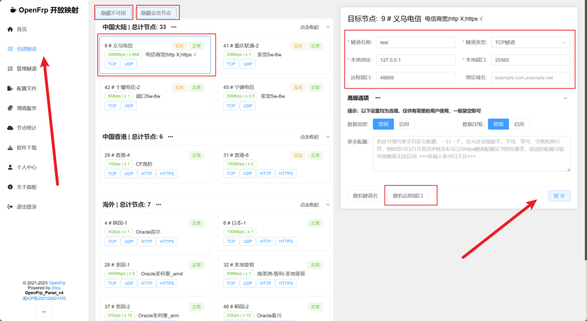

此时应该会跳转至**管理隧道**，如果没有，可以自己点左边的**管理隧道**，保存好**ID**，并点击**详情**

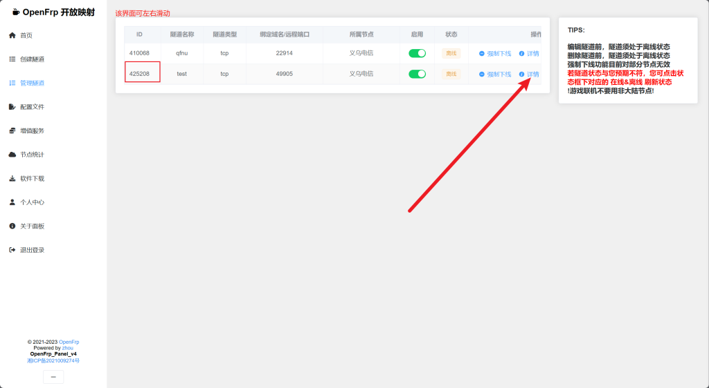

**详情**中的**连接地址**即为以后要连接服务器的地址，也将其保存

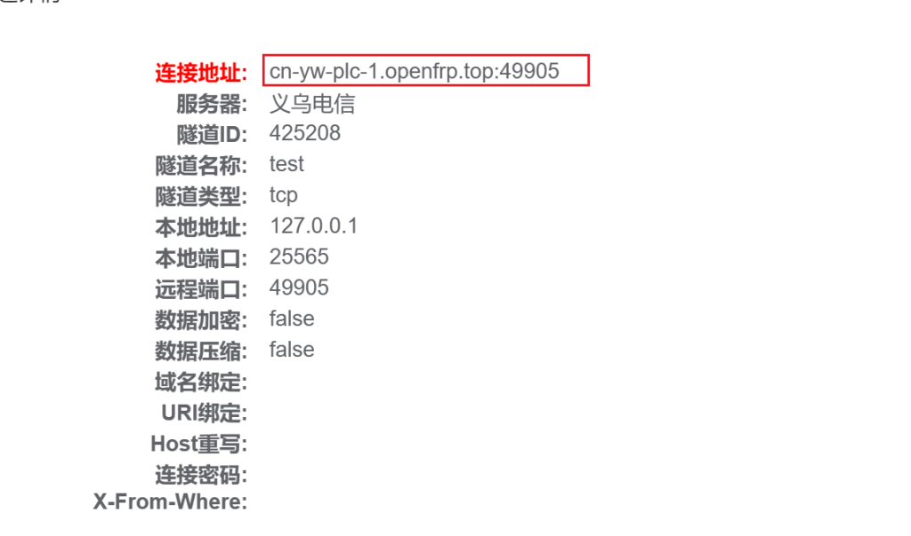

点击左边**首页**，然后点击访问**秘钥**后的**点击查看**，将显示出的**秘钥**保存（注意：请勿将秘钥泄露给他人！）

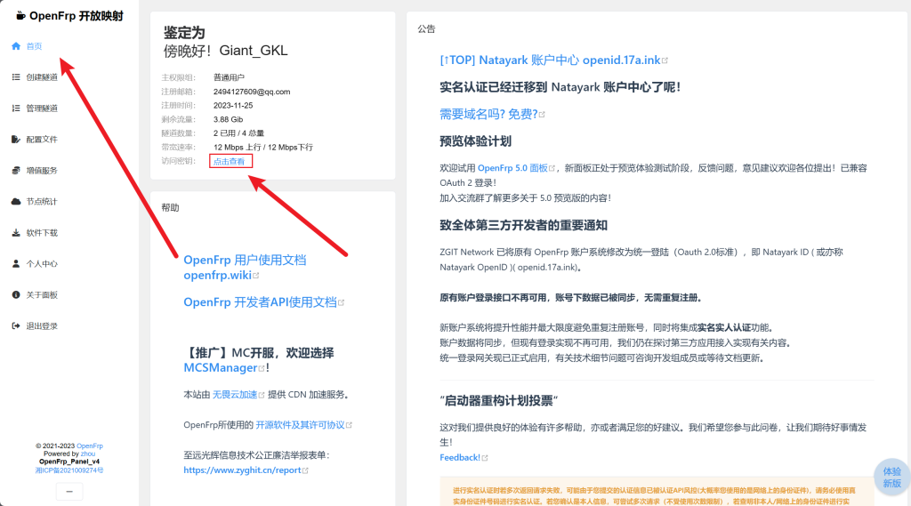

现在，返回**MCSManager**刚才的界面，在**联机方式**下点击**查看**，依次选择**家庭网络联机**——**使用 OpenFrp 内网穿透服务**，然后将刚才保存的**访问秘钥**和**隧道ID**填写，点击**保存**，然后再点击右下角的**保存配置**

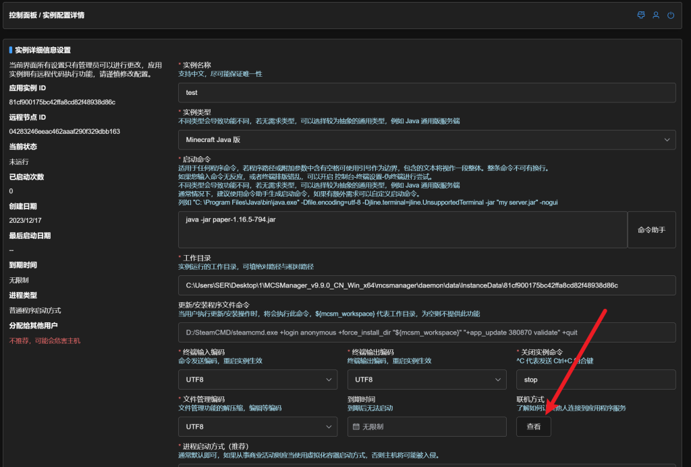

之后你就可以点击左边的**应用实例**，并选择刚刚创建的实例，点击**开始实例**了！第一次启动静待Frp内网映射程序和原版文件的下载，下载完成后，你就会发现，启动并没有成功（如下图所示）

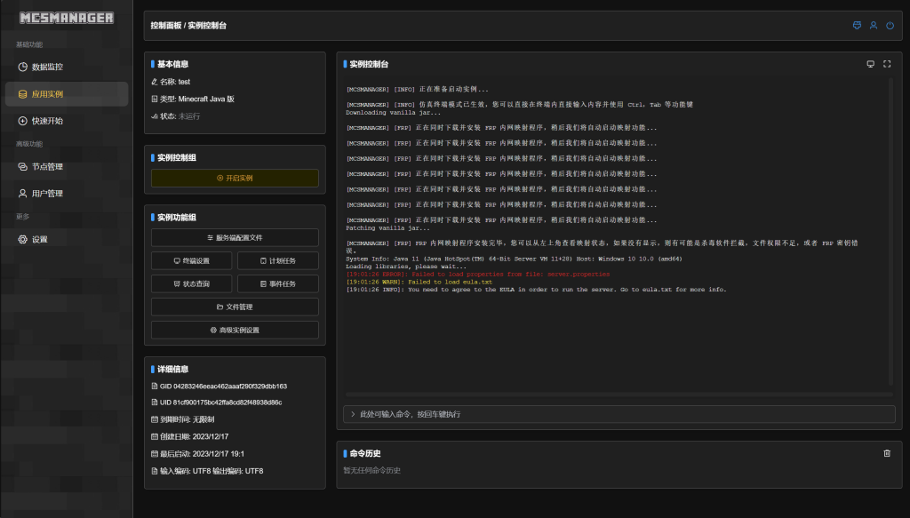

实际上，这只是因为**eula协议**默认是**false**的，现在只需要将他更改为**true**即可，点击左边的**服务端配置文件**

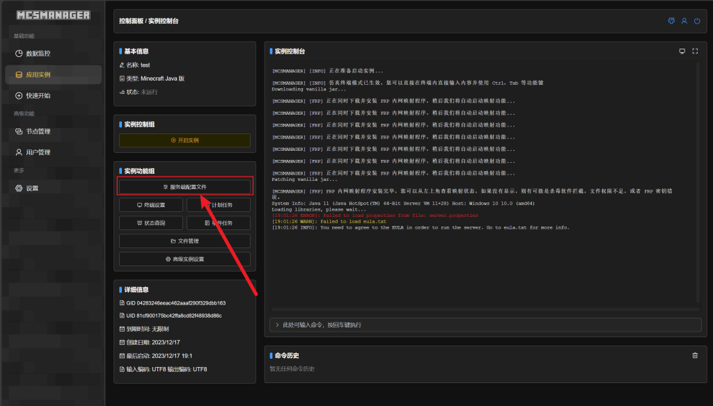

点击**[通用] eula.txt**下的**浏览**

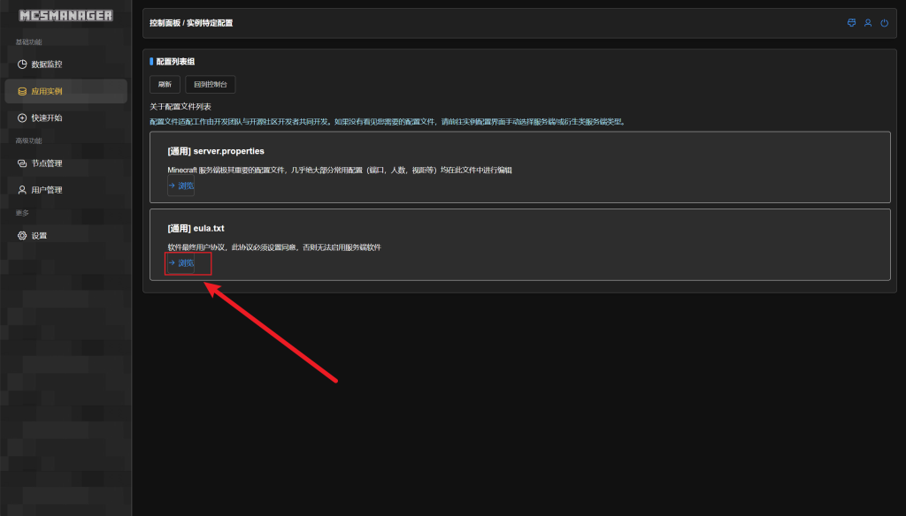

点击右边的选项框，并选择**是**，然后点击左上角的**保存配置**

现在，再**开启实例**，如果看到**Done (xxx.s)! For help, type help**，则代表服务器已经成功开启了！

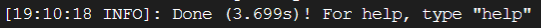

现在我们打开1.16.5的原版Minecraft，点击**多人游戏——添加服务器**，并将刚才保存的ip复制上去，点击确定，你将会看到已经成功连接了！

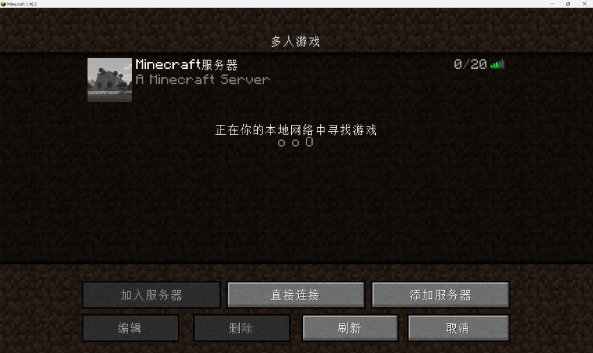

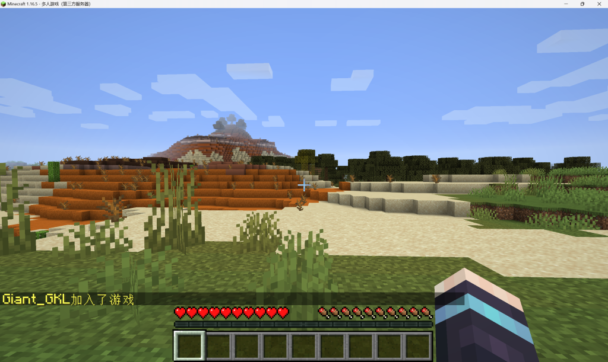
